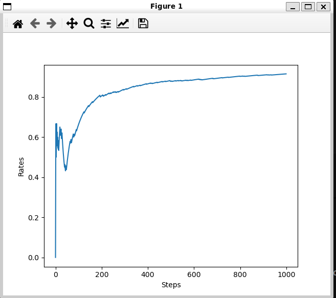
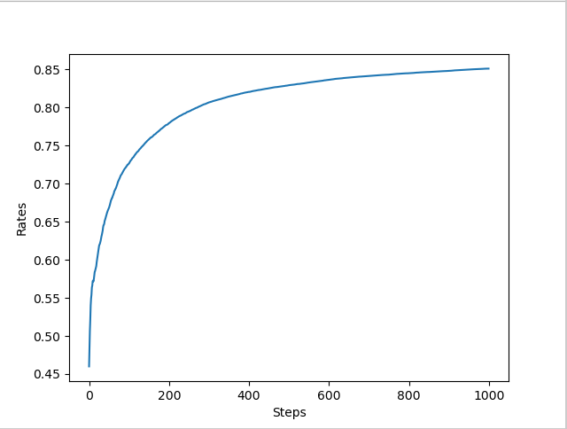
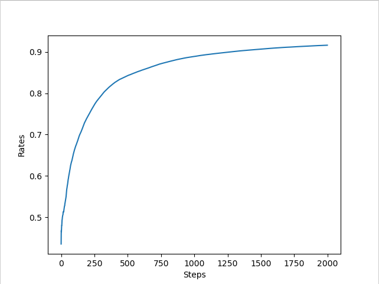

### 1.3.2 求平均值的实现
$Q_n=\frac{R_1+R_2+R_3+...+R_n}{n}$

ch01/avg.py
```
import numpy as np
np.random.seed(0)#固定的随机种子
rewards = []
for n in range(1, 11):
    reward = np.random.rand()#虚拟的奖励
    rewards.append(reward)
    Q = sum(rewards) / n
    print(Q)
```

然而这样会浪费大量的内存并增加计算量
我们可以聚焦在第n-1次的Q<br>
$Q_n$可以表达为$Q_n=(1-\frac{1}{n})Q_{n-1}+\frac{1}{n}R_n$
<br>
或者更简洁的表达为<font color=orange>$Q_n=Q_{n-1}+\frac{1}{n}(R_n-Q_{n-1})$</font>
<br>
```
import numpy as np
np.random.seed(0)#固定的随机种子
# rewards = []
# for n in range(1, 11):
#     reward = np.random.rand()#虚拟的奖励
#     rewards.append(reward)
#     Q = sum(rewards) / n
#     print(Q)

Q = 0
for n in range(1, 11):
    reward = np.random.rand()#虚拟的奖励
    # Q = Q + (reward - Q ) / n
    Q += (reward - Q )/n
    print(Q)
```

### 1.3.3 玩家的策略
玩家选择期望值更高的机器进行游玩，但是期望值可能存在”不确定性“
玩家可以尝试以下两种策略
<ul>
    <li>利用目前的实际的游戏结果，玩那些看起来最好的老虎机（greedy）。</li>
    <li>为了对老虎机的价值做出更准确的估计，尝试不同老虎机。</li>
</ul>
利用(exploitation)和探索(exploration)之间的权衡是强化学习中的一个重要问题。

## 1.4 老虎机算法的实现

### 1.4.1 老虎机的实现
10台老虎机

实现类为Bandit类，在这个类中包含10台老虎机
ch01/bandit.py
```
import numpy as np
class Bandit:
    def __init__(self, arms=10):
        self.rates = np.random.rand(arms)#每一台机器的胜率(返回一个数组)
    
    def play(self, arm):
        rate = self.rates[arm]
        if rate > np.random.rand():
            return 1
        else:
            return 0

if __name__ == "__main__":
    bandit = Bandit()
    print(bandit.rates)#打印每一台机器的胜率
    for i in range(3):
        print(bandit.play(0))
```

玩家的逻辑

使用$\epsilon-greedy$方法进行实现，$\epsilon$表示玩家会随机采取行动的概率

ch01/bandit_test.py
```
# epsilon-greedy算法
class Agent:
    def __init__(self, epsilon, action_size=10):
        self.epsilon = epsilon
        self.Qs = np.zeros(action_size)#每一台机器的平均奖励
        self.ns = np.zeros(action_size)#每一台机器被选择的次数
    
    def update(self, action, reward):
        self.ns[action] += 1
        self.Qs[action] += (reward - self.Qs[action]) / self.ns[action]

    def get_action(self):
        if np.random.rand() < self.epsilon:
            return np.random.randint(len(self.Qs)) #随机选择一台机器
        else:
            return np.argmax(self.Qs) #选择平均奖励最高的机器
```




由于老虎机和agent的行为在每次实验中都是随机的，所以我们需要多次实验来观察平均奖励的变化趋势

ch01/bandit_avg.py
```
runs = 200
steps = 1000
epsilon = 0.1
all_rates = np.zeros((runs, steps))

for run in range(runs):
    bandit = Bandit()
    agent = Agent(epsilon)
    total_reward = 0
    rates = []
    
    for step in range(steps):
        action = agent.get_action()
        reward = bandit.play(action)
        agent.update(action, reward)
        total_reward += reward
        rates.append(total_reward / (step + 1))
 
    all_rates[run] = rates

avg_rates = np.average(all_rates, axis=0)

#绘制图形
plt.ylabel("Rates")
plt.xlabel("Steps")

plt.plot(avg_rates)
plt.show()
```



在$\epsilon-greedy$算法中$\epsilon$ 的值会影响算法的表现，$\epsilon$过大可能导致过多的探索，$\epsilon$过小可能导致过多的利用，无法发现更好的选择。需要调整$\epsilon$的值来找到一个合适的平衡点，获得更好的性能。

## 1.5 非稳态问题
在先前的老虎机问题是一个稳态问题，老虎机的胜率是固定的，但在实际应用中，环境可能是非稳态的，即环境的状态会随着时间发生变化。


ch01/non_stat_bandit.py
```
import numpy as np

class NonStatBandit:
    def __init__(self, arms=10):
        self.arms = arms
        self.rates = np.random.rand(arms)

    def play(self, arm):
        rate = self.rates[arm]
        self.rates += 0.1 * np.random.randn(self.arms) #每次玩都会改变胜率
        if rate > np.random.rand():
            return 1
        else:
            return 0
```

### 1.5.1 解决非稳态问题前的准备工作
在稳态问题中，平均奖励的计算方式是$Q_n=\frac{R_1+R_2+R_3+...+R_n}{n}$

在这种情况下所有的奖励具有相同的权重，因为环境是固定的，过去的奖励和当前的奖励同样重要。但是在非稳态问题中，环境会发生变化，过去的奖励可能不在反应当前的状况，因此我们需要一种方法来降低过去奖励的权重，使得当前的奖励对平均奖励的影响更大。

所以我们可以使用如下的公式来计算平均奖励：

$Q_n=Q_{n-1}+\alpha(R_n-Q_{n-1})$
其中$\alpha$是一个介于0和1之间的常数，称为学习率(learning rate)，它控制了当前奖励对平均奖励的影响程度。当$\alpha$接近1时，当前奖励对平均奖励的影响较大；当$\alpha$接近0时，当前奖励对平均奖励的影响较小。

这个算式展开后为：$Q_n=(1-\alpha)Q_{n-1}+\alpha R_n$


通过观察我们可以得到


$R_n的权重是\alpha$<br>
$R_{n-1}的权重是\alpha(1-\alpha)$<br>
$R_{n-2}的权重是\alpha(1-\alpha)^2<br>
$R_{n-3}的权重是\alpha(1-\alpha)^3<br>
...<br>
$R_1的权重是\alpha(1-\alpha)^{n-1}$<br>


### 1.5.2 解决非稳态问题的实现

ch01/non_stat_bandit_test.py
```
import numpy as np
import matplotlib.pyplot as plt


class NonStatBandit:
    def __init__(self, arms=10):
        self.arms = arms
        self.rates = np.random.rand(arms)

    def play(self, arm):
        rate = self.rates[arm]
        self.rates += 0.1 * np.random.randn(self.arms) #每次玩都会改变胜率
        if rate > np.random.rand():
            return 1
        else:
            return 0
        
class AlphaAgent:
    def __init__(self, epsilon, alpha, actions=10):
        self.epsilon = epsilon
        self.alpha = alpha
        self.Qs = np.zeros(actions)
    
    def update(self, action, reward):
        #使用alpha更新法更新Q值
        self.Qs[action] += self.alpha * (reward - self.Qs[action])
    
    def get_action(self):
        if np.random.rand() <self.epsilon:
            return np.random.randint(0, len(self.Qs))
        else:
            return np.argmax(self.Qs)
        
# if __name__ == "__main__":
#     steps = 1000
#     epsilon = 0.1
#     alpha = 0.1

#     bandit = NonStatBandit()
#     agent = AlphaAgent(epsilon, alpha)

#     total_reward = 0
#     total_rewards = []
#     rates = []

#     for step in range(steps):
#         action = agent.get_action()
#         reward = bandit.play(action)
#         agent.update(action, reward)
#         total_reward += reward

#         total_rewards.append(total_reward)
#         rates.append(total_reward / (step + 1))
    
#     print(total_reward)
#     plt.ylabel("Total Reward")
#     plt.xlabel("Steps")
#     plt.plot(total_rewards)
#     plt.show()
    
#     plt.ylabel("Rates")
#     plt.xlabel("Steps")
#     plt.plot(rates)
#     plt.show()


if __name__ == "__main__":
    runs = 200
    steps = 2000
    epsilon = 0.1
    alpha = 0.1
    all_rates = np.zeros((runs, steps))

    for run in range(runs):
        bandit = NonStatBandit()
        agent = AlphaAgent(epsilon, alpha)

        total_reward = 0
        rates = []

        for step in range(steps):
            action = agent.get_action()
            reward = bandit.play(action)
            agent.update(action, reward)
            total_reward += reward
            rates.append(total_reward / (step + 1))
        
        all_rates[run] = rates
    
    avg_rates = np.average(all_rates, axis=0)

    #绘制图形
    plt.ylabel("Rates")
    plt.xlabel("Steps") 
    plt.plot(avg_rates)
    plt.show()
```



指数加权平均(exponentially weighted average):
它使得最近的奖励对平均奖励的影响更大，而较早的奖励对平均奖励的影响逐渐减小。这种方法适用于非稳态问题，因为它能够更快地适应环境的变化。
<font color=orange>$Q_n=Q_{n-1}+\alpha(R_n-Q_{n-1})$</font><br>

样本平均：
<font color=orange>$Q_n=Q_{n-1}+\frac{1}{n}(R_n-Q_{n-1})$</font>
